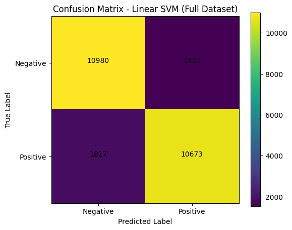

# sentiment-analysis-movie-reviews-iu

IU Project NLP : DLBAIPNLP01 - Task 1  
Sentiment Analysis on Movie Reviews using IMDB Dataset

## Project Overview
This project implements a complete Natural Language Processing (NLP) pipeline to classify movie reviews as **Positive** or **Negative**.

The system was developed using Python and Google Colab was used for notebooks.

The objective of the project is to:
- Collect publicly available movie review data
- Preprocess text data
- Train supervised machine learning models
- Evaluate performance on a separate test dataset
- Compare model performance

## Dataset Information

**Dataset:** IMDB Large Movie Review Dataset  
**Source:** Stanford AI Lab  
**URL:** https://ai.stanford.edu/~amaas/data/sentiment/  
**File Used:** aclImdb_v1.tar.gz  

Dataset Characteristics:
- 25,000 training reviews
- 25,000 testing reviews
- Balanced dataset (50% positive, 50% negative)

## NLP Pipeline

The following steps were implemented:
### 1 Data Collection
- Dataset downloaded directly from Stanford AI

### 2 Text Preprocessing
- Lowercasing
- HTML tag removal
- Removing special characters
- Stopword removal (NLTK)
- Lemmatization (WordNet)

### 3 Feature Extraction
- TF-IDF Vectorization (Term Frequency – Inverse Document Frequency)

### 4 Supervised Learning Models
- Multinomial Naive Bayes
- Linear Support Vector Machine (Linear SVM)

### 5 Model Evaluation Metrics
- Accuracy
- Precision
- Recall
- F1-score
- Confusion Matrix

## Experiments Conducted:

### Small Experimental Subset
- 2,000 samples
- 80/20 train-test split

### Full Dataset Experiment
- 25,000 training samples
- 25,000 testing samples (official split)

## Results

| Dataset | Model | Accuracy |
|----------|--------|-----------|
| Small (2,000 samples) | Naive Bayes | 0.8425 |
| Small (2,000 samples) | Linear SVM | 0.8525 |
| Full (25k train / 25k test) | Naive Bayes | 0.8312 |
| Full (25k train / 25k test) | Linear SVM | 0.8661 |

### Observation
Linear SVM consistently outperformed Naive Bayes on both the small subset and the full dataset.

## Confusion Matrix (Linear SVM – Full Dataset)

## Frameworks & Libraries Used

- Pandas and NumPy (data manipulation and processing)
- TF-IDF Vectorizer (feature extraction)
- NLTK (for text preprocessing and lemmatization)
- Scikit-learn (for Naive Bayes and Linear SVM models)
- Matplotlib (visualization of confusion matrix)

## Author
Siddharthsinh Rathod
Project NLP : DLBAIPNLP01 - Task 1  
IU International University of Applied Sciences
